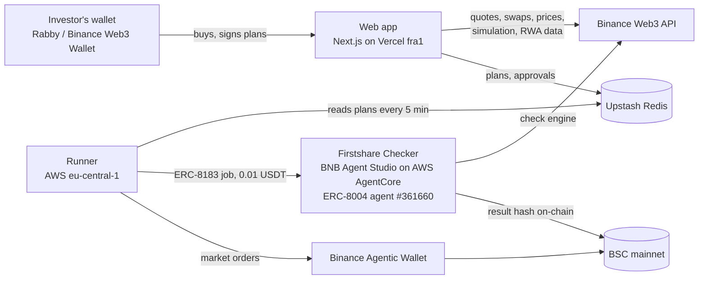

# Firstshare

**Your first US stock, from $1, on BNB Smart Chain.** Firstshare takes people who have never owned a stock to their first share of any of 470+ US companies and funds, from Apple and Nvidia to the S&P 500, as a tokenized stock held in their own wallet. It explains what they're buying, refuses to let them overpay when New York is closed, and runs plain-English investing plans for them.

Firstshare never holds anyone's money: buys come straight from the investor's own wallet, and no contract or server of ours can move their funds.

- **Live:** https://firstshare.site
- **Demo video:** https://youtu.be/MP1cbdk6wSU
- Built for **BNB Hack: Tokenized Stocks Edition** on BSC mainnet, using the **Binance Web3 API**, **BNB Agent Studio** and the **Binance Agentic Wallet**.

## What it does

1. **Find a company and buy it with your own wallet.** Search "Apple" or "S&P 500", see what one share costs and what $1 buys, and buy with Rabby, Binance Web3 Wallet or WalletConnect. bStocks are the default issuer (24/7, from $1); Ondo is the fallback.
2. **Never overpay.** Before every buy, Firstshare compares the price you'd actually pay on-chain with the real New York price and gives a verdict in plain English: *"You'd pay $234.77 a share, 0.04% below New York's $234.87."* Off-hours, tokenized stocks can drift well above the real price; the check catches it.
3. **Plans in plain English.** Write *"Buy $10 of Apple every Monday, and $20 more when it drops 5%"*. Firstshare turns it into rules you can read, replays them on a year of on-chain prices, and runs them:
   - **Practice:** live prices, pretend money.
   - **Ask me first:** each fair-priced buy waits for you to approve it and buy from your own wallet.
   - **Run it for me:** an agent pays our **Checker** agent for an independent price check, then buys through a **Binance Agentic Wallet**, around the clock.

## How it's built



| Part | Where | What it does |
|---|---|---|
| `packages/core` | shared | Binance Web3 API client, merged bStock + Ondo catalog, fair-price check engine, plan rules, backtest, rule engine. The app, Checker and Runner all import it, so they give identical answers. |
| `apps/web` | Vercel (Frankfurt) | Search, stock pages, buy flow (quote → simulate → approve → swap → receipt), plan builder (Claude reads the English, the rules are validated in code), plans with signed start/pause/approve. |
| `apps/checker` | AWS AgentCore, eu-central-1 | A **BNB Agent Studio** seller agent. Sells the pre-trade check over **ERC-8183** (and x402, see below), holds an **ERC-8004** identity, never trades. |
| `apps/runner` | EC2, eu-central-1 | Evaluates every plan every 5 minutes. In "run it for me" it runs the free check, pays the Checker only when that passes, double-checks the Agentic Wallet's own quote against New York, places the order, records the transaction, and later settles the Checker's escrow. |

Notes from building on the stack:

- The **fair price** is the Ondo token's `rwa/underlying-market` reference price × its token-to-share ratio, applied to every issuer of the ticker; when New York is closed we fall back to the last recorded value.
- `rwa/tokens` lists only part of the bStock catalog, so it's merged with Binance's public RWA list.
- All Binance API calls run in EU regions, since the API refuses restricted regions with `40304` inside an HTTP 200.
- The Studio SDK's `WalletProvider.makeExecutor()` hook lets `ERC8183Client` run unchanged on a Binance Agentic Wallet: each SDK intent becomes a `baw contract-call`.

## Verify it yourself

Everything below is on BSC mainnet.

| What | Link |
|---|---|
| Checker's ERC-8004 identity (agent **#361660**) | registration tx [`0x31af1096…39aa`](https://bscscan.com/tx/0x31af109685dc9d15eaed98170275d61079b8bcde0d8f1bee4f65a2b17b4839aa) on registry [`0x8004…a432`](https://bscscan.com/address/0x8004A169FB4a3325136EB29fA0ceB6D2e539a432) |
| Checker wallet (receives check payments) | [`0x8650…1b14`](https://bscscan.com/address/0x86502596665183ef82047A8c9772eB25Dbb01b14) |
| ERC-8183 escrow (Commerce) | [`0xea4d…eba6`](https://bscscan.com/address/0xea4daa3100a767e86fded867729ae7446476eba6), jobs 56869, 56870, 56891, 56893, 56906 |
| Agentic Wallet used by the runner | [`0xcA5A…68d2`](https://bscscan.com/address/0xcA5A60e133C9650ea391Be41983879a0bA2E68d2) |
| Unattended buy #1 (Sun 4 Oct, NY closed), after paid check job 56893 | [`0x429b8e2c…2e7e`](https://bscscan.com/tx/0x429b8e2c67f57fe9ed80851d123db55a9d843579b29033274cc67e5169542e7e) |
| Unattended buy #2 (Mon 5 Oct 00:03 UTC, NY closed), after paid check job 56906 | [`0x77612572…0cc6`](https://bscscan.com/tx/0x776125721517ac64f32d52bdf52c26e9d028affd3c9a94c0a3da16b23ab30cc6) |
| Each Checker result | stored at a content-addressed URL; its hash is the job's on-chain `deliverable` |

## Run it locally

Requires Node 22 and a Binance Web3 API key. Run it from a region the API serves (not the US, UK, Canada, Japan…).

```bash
npm install
cp .env.example .env                      # Binance API key + secret, Upstash URL + token, Checker client secret (runner)
cp .env.example apps/web/.env.local       # Binance API, Upstash, Anthropic key, WalletConnect project id
npm run dev -w @firstshare/web            # http://localhost:3000
npm test -w @firstshare/core
```

### Run your own runner with your own Agentic Wallet

A Binance Agentic Wallet is personal: it's signed into one machine by QR. So "run it for me" on firstshare.site is limited to the runner's operator; anyone can run their own runner:

```bash
npm i -g @binance/agentic-wallet
baw auth signin                           # confirm in the Binance app; enable Developer mode for contract calls
npm run start -w @firstshare/runner       # reads plans from the same store and trades through your wallet
```

Set `NEXT_PUBLIC_RUNNER_AGENTIC_WALLET` to your Agentic Wallet address and `RUNNER_OPERATORS` to the wallets allowed to start "run it for me" plans. `apps/runner/deploy/deploy.sh` ships it to an EC2 box.

## Honest limits

- **x402 is built but dormant.** The Checker serves x402 through B402, which needs merchant approval. The documented application form is restricted to Binance's own Google organisation, so outside developers can't apply. Paying through ERC-8183 works today.
- **Agentic Wallet sessions last 48 hours** and are signed in by QR, so an always-on runner needs a person to re-sign it every two days.
- **The Checker's plain-English explanation uses a free model,** so it's occasionally missing. The verdict and numbers come from the check engine and are always there.
- Not investment advice. Prices move, and you can lose money.
